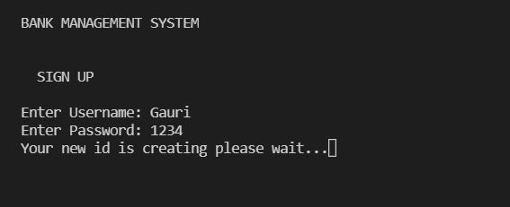
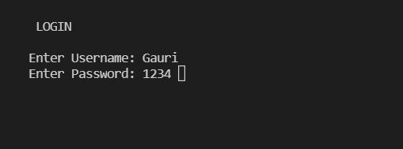
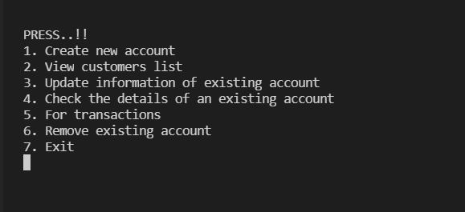
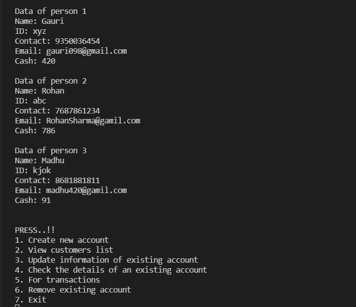
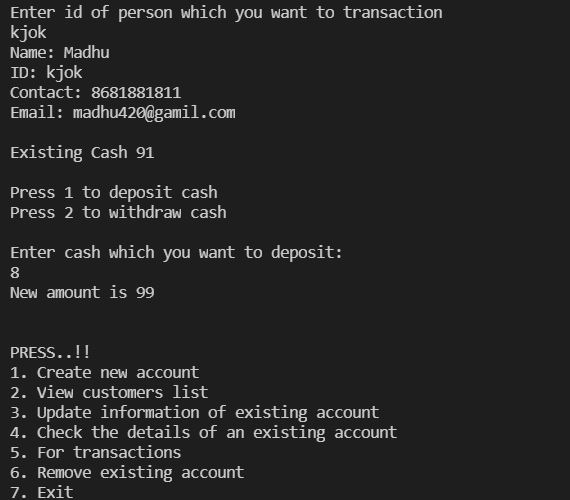
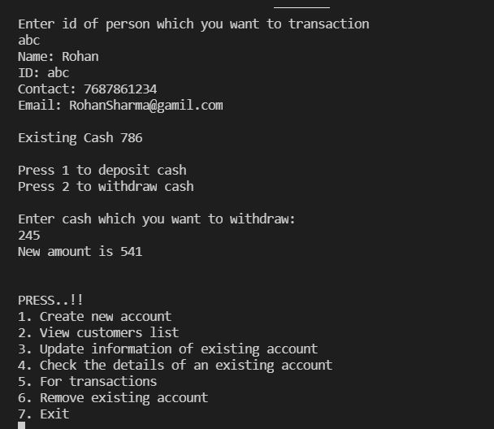

# Bank-Management-System
The Bank Management Project in C++ language is a beginner project and is created using concepts of Object-oriented Programming.  Here, the user can perform all the tasks like creating an account, deposit amount, withdraw amount, check balance, view all account holders detail, close an account, modify an account, search details of a user, transact amount and delete an account. All the main features for the banking system are set in this project.

## Features

* Sign up a new user
* Login an existing user
* Creating a new account
* Enter the data of a existing user
* Display the details of the user
* Modify the details of the user
* Search the details of a user
* Transactions
* Delete the data of a user

## Images
  
 
 
 
 
 
 

